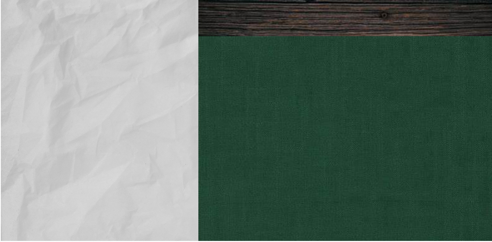

# Yahtzee - Anthony Dicaire

## Description
This application is a clone of the dice game Yahtzee created using HTML, CSS and JS.
It consists of a simple home page with the rules. 

## Rules
- Press the button in the upper left corner of the screen to roll the dice
- Click on a die to put it in the group of held dice. These will not be rolled
- 3 rolls before you have to select a score. Choosing a score that does not have a number scratches it
- Fill out the score card in order to end the game

## Palette
- Text Colour : black (#000000) chosen for contrast against the white paper
- Possible Selection text Colour : dark blue (#0005ad) chosen for visibility against the rest of the board. This is important to have visible as this will be the colour of the options for score that the user chooses.
#0005ad specifically as a lighter version of a friend's favourite colour (#00027a)

## Typography
- Font Family : 'cursive'
- Font Size : 24px, 48px for titles
- Font Styles : Title and headings are bold
I chose this font style as it is sort of supposed to have a 'done on a scrap of paper' feel as a general theme

## Components and Layout
### Structure
There will be a HTML file to display everything and a JS reference to the elements for functionality
The elements are stored in an array and their visibility and interactivity is set via the game state
The game background is a HTML div grid that uses a group of images to draw the game board and score card

### Game State 
- Main Menu : Crumpled paper with the game title and the buttons to start. There is also an easter egg where clicking on the dice in the background rolls them
- Rulebook Screen : Crumpled paper with the game rules and a back button taking you back to the previous state (the previous state is saved as a variable)
- Settings Screen : Crumpled paper with a list of options that you can choose. The back button works the same as the rulebook screen's back button
- Play State : Has the scorecard as a table on the left (on a crumpled piece of paper), a green background with the dice, and a wooden top block for the selected dice. There is a button that rolls the dice in the top left.

### Animations
- Upon clicking a die, it glides to the top bar
- The dice bounce to a random position on the screen when rolled
- There are some buttons on the bottom of the score card that allow the user to access the options and the rules
- The main menu screen has a button for the rules and a button to start
- Menus such as the options menu and the rules menu have a back button that returns to the previous game state. Said game state is stored when the menus open. On press it takes the player back to that state
- Once the game ends, the score is displayed. You can press 'play again' or 'quit' where 'quit' returns you to the main menu
These animations are subtle but effective in the overall feel of the game

### Layout

- Dice on click collect at the top alongside the roll button for the dice (top right)
- Score div grid is stored on the left piece of paper
- The dice are rolled on the main green cloth when the roll dice button is pressed

## Conclusion
This is a file describing the details of the Yahtzee game program.
It goes into details on how the program UI is done and the stylistic choices selected for this program.